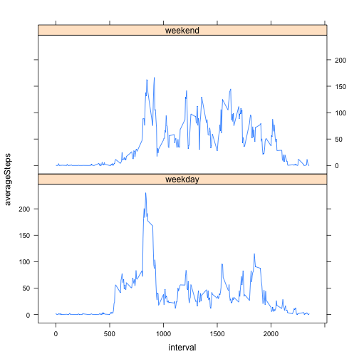

---
title: "Reproducible Research: Peer Assessment 1"
output: html_document
---
**Loading and preprocessing the data.**


```r
library(dplyr)
activity <- tbl_df(read.csv(file="activity.csv",header=TRUE))
```

**What is the mean total number of steps taken per day?**


```r
dailySteps <- tapply(activity$steps[!is.na(activity$steps)], INDEX = activity$date[!is.na(activity$steps)], FUN = sum)
hist(dailySteps,breaks=22,col="blue")
```

 

```r
mean(dailySteps,na.rm=TRUE)
```

```
## [1] 10766.19
```

```r
median(dailySteps,na.rm=TRUE)
```

```
## [1] 10765
```

**What is the average daily activity pattern?**


```r
intervalAverage <- tapply(activity$steps,INDEX = activity$interval, FUN = mean, na.rm=TRUE)
plot(unique(activity$interval),intervalAverage,type="l", col = "green",
     xlab="Interval",ylab = "Average Steps", main = "Average steps on each 5 min interval")   
```

 

The 104th element of intervalAverage - the interval 835 - has the maximum average steps as follows:


```r
which(max(intervalAverage) == intervalAverage)
```

```
## 835 
## 104
```

...and that maximum average is:


```r
intervalAverage[104]
```

```
##      835 
## 206.1698
```

**Inputting missing values**

The total number of NA rows in the dataset is:


```r
    sum(is.na(activity$steps))
```

```
## [1] 2304
```

Replace NA values with 5-minute interval average.


```r
    activity$steps[is.na(activity$steps)] <- intervalAverage
```

Create histogram, mean and median of daily steps with NAs replaced

```r
    dailyStepsReplacedNAs <- tapply(activity$steps, INDEX = activity$date, FUN = sum)
    hist(dailyStepsReplacedNAs,breaks = 22, col = "red")
```

 

```r
    mean(dailyStepsReplacedNAs)
```

```
## [1] 10766.19
```

```r
    median(dailyStepsReplacedNAs)
```

```
## [1] 10766.19
```

Replacing the NAs with causes the number of bins corresponding to the mean value to increase by 8, as there were 8 days full of NA values, which now have the mean number of steps. The mean remains the same and the median is now equal to the mean as we have a realised value of the mean in the data set of total number of daily steps.

**Are there differences in activity patterns between weekdays and weekends?**


```r
    activity$weekday <- weekdays(as.Date(activity$date))
    activity$weekday[activity$weekday == "Saturday"] <- "Weekend"
    activity$weekday[activity$weekday == "Sunday"] <- "Weekend"
    activity$weekday[activity$weekday != "Weekend"] <- "Weekday"
    activity$weekday <- as.factor(activity$weekday)
    
    intAvWeekday <- as.data.frame(tapply(activity$steps, 
                                      INDEX = activity[,c("interval","weekday")], FUN =mean))
    intAvWeekday$intervals <- as.numeric(rownames(intAvWeekday))
    
    library(lattice)
```

```
## Warning: package 'lattice' was built under R version 3.1.3
```

```r
    #make data frame in suitable format for lattice... probably in a very innefficient manner
    l <- dim(intAvWeekday)[1]
    Weekday <- factor(c(rep("weekday",l),rep("weekend",l)))
    latticeDF <- data.frame(interval = rep(intAvWeekday$intervals,2),
                       averageSteps = c(intAvWeekday$Weekday,intAvWeekday$Weekend),
                       weekdayWeekend = Weekday)

    xyplot(averageSteps ~ interval | weekdayWeekend,data=latticeDF,type="l",layout = c(1,2))
```

 

It appears that on weekdays there is a spike of activity in the morning and a smaller spike in the evening, whilst throughout the middle portion of the day there is less activity. On the weekend there is no large morning or evening spike, however the activity is slightly higher on average for the middle portion of the day.

